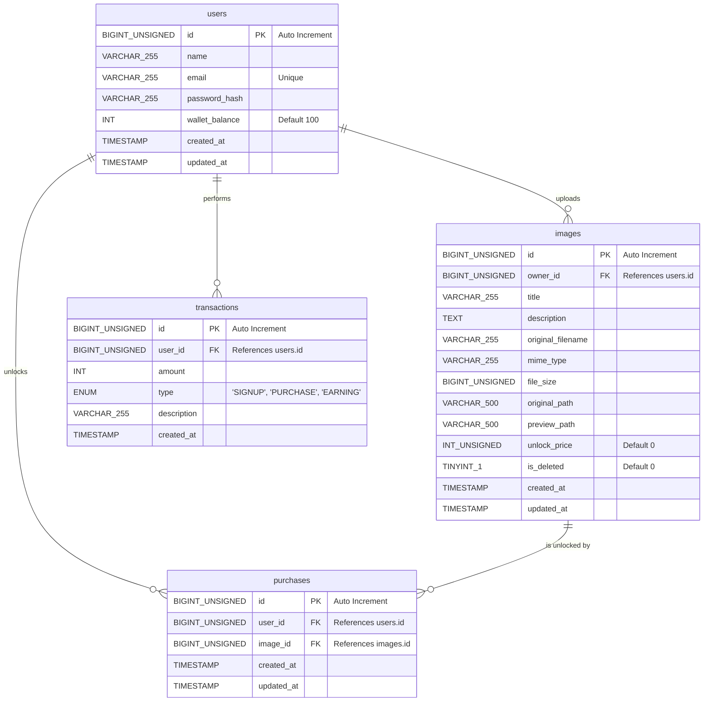

# Media Lock Database Schema & ER Diagram

This document contains the detailed database structure, Entity-Relationship (ER) diagram, table attributes, data types, indexes, and referential integrity constraints of the Media Lock project.

---

## 📊 Entity-Relationship (ER) Diagram

The project uses a MySQL database. Below is the ER diagram representing the entities, their properties, keys, and relationships.

---

## 🗄️ Tables and Purpose

### 1. `users` Table
Stores registered user accounts, passwords, and their current coin balance.
*   **Columns**:
    *   `id` (BIGINT UNSIGNED): Primary Key. Auto-incremented unique user identifier.
    *   `name` (VARCHAR 255): The user's display name.
    *   `email` (VARCHAR 255): Unique email address used for login authentication.
    *   `password_hash` (VARCHAR 255): Secure bcrypt hash of the user's password.
    *   `wallet_balance` (INT): Active wallet coin balance (defaults to `100` on signup).
    *   `created_at` (TIMESTAMP): Time of registration.
    *   `updated_at` (TIMESTAMP): Automatically updated timestamp of last profile modification.

### 2. `images` Table
Stores premium uploaded media listings. Original files are protected, while preview versions are blurred.
*   **Columns**:
    *   `id` (BIGINT UNSIGNED): Primary Key. Auto-incremented unique image identifier.
    *   `owner_id` (BIGINT UNSIGNED): Foreign Key referencing `users(id)`. Identifies the uploader/seller.
    *   `title` (VARCHAR 255): Title of the image listing.
    *   `description` (TEXT): Detailed description of the premium image.
    *   `original_filename` (VARCHAR 255): The original filename uploaded by the user.
    *   `mime_type` (VARCHAR 100): MIME type of the file (e.g. `image/jpeg`, `image/png`).
    *   `file_size` (BIGINT UNSIGNED): File size in bytes.
    *   `original_path` (VARCHAR 500): Physical server disk path to the full-resolution secure raw file.
    *   `preview_path` (VARCHAR 500): Physical server disk path to the resized blurred thumbnail file.
    *   `unlock_price` (INT UNSIGNED): Coin cost required for other users to unlock this image (defaults to `0`).
    *   `is_deleted` (TINYINT 1): Soft deletion flag (defaults to `0`). Set to `1` when owner deletes listing.
    *   `created_at` (TIMESTAMP): Time of upload.
    *   `updated_at` (TIMESTAMP): Time of last modification.

### 3. `purchases` Table
A join table mapping users to the images they have unlocked. Enables access checks for the original stream.
*   **Constraints**:
    *   `uq_user_image` UNIQUE constraint on `(user_id, image_id)` to prevent buying the same image multiple times.
*   **Columns**:
    *   `id` (BIGINT UNSIGNED): Primary Key.
    *   `user_id` (BIGINT UNSIGNED): Foreign Key referencing `users(id)`. The buyer.
    *   `image_id` (BIGINT UNSIGNED): Foreign Key referencing `images(id)`. The unlocked image.
    *   `created_at` (TIMESTAMP): Time of purchase.
    *   `updated_at` (TIMESTAMP): Time of last update.

### 4. `transactions` Table
An audit ledger log recording all coin balance modifications (signups, purchases, and earnings).
*   **Columns**:
    *   `id` (BIGINT UNSIGNED): Primary Key.
    *   `user_id` (BIGINT UNSIGNED): Foreign Key referencing `users(id)`. Target wallet.
    *   `amount` (INT): Coin change (positive for earnings/credits, negative for purchases/debits).
    *   `type` (ENUM): Transaction type descriptor (`SIGNUP`, `PURCHASE`, `EARNING`).
    *   `description` (VARCHAR 255): Human-readable audit log description.
    *   `created_at` (TIMESTAMP): Time of transaction log entry.

---

## ⚡ Database Performance Indexes
To optimize performance during high load and ensure rapid query response times:
1.  `idx_users_email`: Built on `users(email)` for fast credential matching during logins.
2.  `idx_images_owner_id`: Built on `images(owner_id)` for quick lookup of owner's images on profile pages.
3.  `idx_purchases_lookup`: Compound index built on `purchases(user_id, image_id)` for lightning-fast unlocking state validation.
4.  `idx_transactions_user_id`: Built on `transactions(user_id)` for retrieving user ledger history logs.
