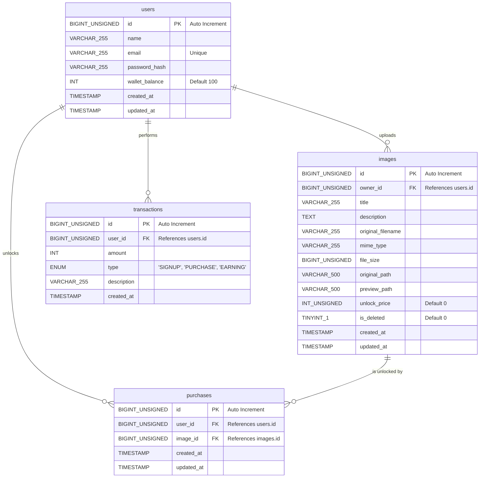

# Media Lock: Full Stack Premium Media Locker Application

A secure, production-grade monetization platform allowing users to register, upload premium images locked behind a blurred preview, and purchase access to unlock and stream full-resolution original files. 

The application utilizes an atomic database ledger system to handle coins transactions securely, preventing race conditions or double-spending.

---

## 🚀 Key Features

*   **User Registration & Authentication**: Secure sign-up/sign-in flows via JSON Web Tokens (JWT). Newly registered users receive an initial credit of **100 coins**.
*   **Dynamic Home Feed**: Displays locked and unlocked media cards with smooth press animations. Locked cards show the image with a server-side blurred preview and price badge. Unlocked cards display the unlocked status.
*   **Media Upload & Lock**: Form-based upload with selection from the device gallery. The backend uses `sharp` to process and compress the uploaded media, generating a blurred, resized preview file.
*   **Safe Purchase Flow (Atomic Ledger)**: MySQL database transaction-wrapped purchases. Buyer is deducted, seller is credited, and transaction audit logs are written atomically. If any step fails, the entire transaction is rolled back.
*   **Secure Original Image Viewer**: Streams protected original images directly from the backend. The frontend utilizes custom Axios binary stream loaders to enforce JWT Authorization headers and renders images as Base64 data URIs, protecting images from direct URL sniffing.
*   **Owner Media Deletion**: Owners can soft-delete their listings directly from the detail screen. This immediately hides the image from all feeds while preserving existing purchase logs and transactions for audit integrity.
*   **Wallet & Transaction History**: Real-time display of current coins balance alongside detailed debit/credit logs of all earnings, sign-ups, and purchases.
*   **Purchased Media Tab**: Dedicated collection feed displaying every locked item that the user has successfully purchased and unlocked.
*   **Cross-Platform Layouts**: Fully responsive layouts using `react-native-safe-area-context` to prevent header clipping on Android, with specialized bottom padding to clear floating Metro tab bars.

---

## 📊 Database Schema & ER Diagram

The database structure relies on relations enforcing referential integrity. Indices are configured for fast lookups.

### Database ER Diagram


### Table Purpose Explanations

1.  **`users`**: Stores user identities, auth credentials, and the user's active wallet coin balance.
2.  **`images`**: Stores premium uploaded image metadata, pricing, ownership, soft-deletion status, and the physical disk paths to both the raw original file and the blurred preview file.
3.  **`purchases`**: Join table mapping buyers to their unlocked images. Enforces a `UNIQUE(user_id, image_id)` constraint so an image can only be bought once by a user.
4.  **`transactions`**: Audit ledger tracking every coin fluctuation. Records the user, coin amount (positive for credits, negative for debits), transaction type (`SIGNUP`, `PURCHASE`, `EARNING`), and a human-readable description.

---

## 🛠️ Tech Stack

### Backend Service
*   **Runtime**: Node.js (ES Modules)
*   **Framework**: Express.js
*   **Database**: MySQL
*   **Image Manipulation**: Multer (file parsing) & Sharp (resizing/blurring)
*   **Validation**: Express-Validator
*   **Logging**: Morgan

### Frontend Client
*   **Framework**: React Native & Expo (SDK 54 compatibility)
*   **Navigation**: Expo Router (File-based router with bottom tabs)
*   **Form Management**: React Hook Form + Zod Schema Validation
*   **Storage**: AsyncStorage
*   **HTTP Client**: Axios (configured with request/response interceptors)

---

## ⚙️ How to Run the Project

### Prerequisites
*   Ensure MySQL is installed and running on port `3306`.
*   Ensure Node.js (v18+) is installed.

### 1. Backend Configuration
1.  Initialize database tables using the schema file:
    ```bash
    mysql -u root -p < schema.sql
    ```
2.  Configure your env parameters by creating a `.env` file in the root folder:
    ```env
    PORT=5000
    NODE_ENV=development
    DB_HOST=localhost
    DB_USER=root
    DB_PASSWORD=your_mysql_password
    DB_NAME=paid_media_locker
    DB_PORT=3306
    JWT_SECRET=your_jwt_secret_key_here
    JWT_EXPIRES_IN=7d
    INITIAL_COIN_BALANCE=100
    ```
3.  Install dependencies and start the dev server:
    ```bash
    npm install
    npm run dev
    ```
    The server will boot at `http://localhost:5000`.

### 2. Frontend Expo Configuration
1.  Navigate into the `frontend` folder:
    ```bash
    cd frontend
    ```
2.  Configure the LAN server IP in `frontend/src/constants/api.js`:
    ```javascript
    export const API_CONFIG = {
      // Replace with your machine's active local Wi-Fi IPv4 address
      baseUrl: 'http://192.168.X.X:5000/api/v1',
      timeout: 10000
    };
    ```
3.  Install and launch the Expo Metro Bundler:
    ```bash
    npm install --legacy-peer-deps
    npx expo start -c
    ```
4.  Open the app by scanning the QR code in your physical device's **Expo Go** application.
