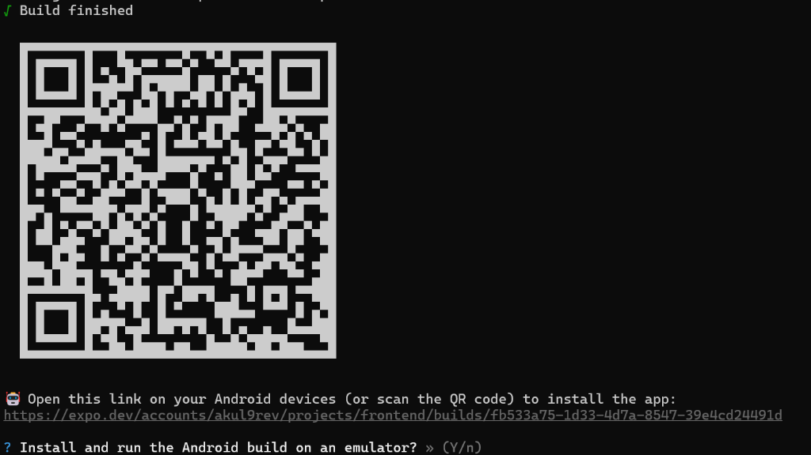

# Media Lock Setup Instructions

This document provides step-by-step instructions to install and run the Media Lock application. You can either install the pre-compiled APK directly on an Android device or run the project locally from source code.

---

## 📱 Method 1: Direct Android APK Installation (Recommended)

The APK is pre-compiled and configured to connect directly to the hosted production Render backend (`https://mediavault-c0ts.onrender.com/api/v1`). You do **not** need to set up or run a local backend database to test using this method.

### Download Link & QR Code
*   **Direct Link**: [EAS Android Build Artifact](https://expo.dev/accounts/akul9rev/projects/frontend/builds/fb533a75-1d33-4d7a-8547-39e4cd24491d)
*   **Build QR Code**:
    
    

### Installation Steps:
1.  Open the link above on your Android device, or scan the QR code using your device camera or a QR scanner app.
2.  Click the **Download** button on the Expo EAS build page to download the `.apk` file.
3.  Once downloaded, open the file to install it. If prompted by your browser or file manager, enable **"Allow installation from unknown sources"**.
4.  Open the **MediaVault** app from your app drawer.
5.  Create a new account (credited with initial coins) or login with an existing account to start testing.

### 🔑 Demo Accounts

For convenient testing on the production backend, you can log in directly using either of these pre-configured demo accounts:

*   **Account 1**:
    *   Email: `akultest1@gmail.com`
    *   Password: `Password@123`
*   **Account 2**:
    *   Email: `demo@gmail.com`
    *   Password: `12345678`

---------

## 💻 Method 2: Running from Source Code (Local Development)

To run the application locally on your machine, you must set up the MySQL database, boot the Express backend server, and run the Expo client.

### Prerequisites:
*   Node.js (v18+) installed.
*   MySQL Server installed and running locally on port `3306`.
*   Expo Go application installed on your Android device (for LAN testing).

---

### Step 1: Backend & Database Setup

1.  **Initialize MySQL Database**:
    Open your MySQL terminal and run the schema script located in the root directory to create all required tables, constraints, and indexes:
    ```bash
    mysql -u root -p < schema.sql
    ```

2.  **Configure Environment Variables**:
    Create a file named `.env` in the root folder of the project and populate it with your local configurations (use the template below):
    ```env
    PORT=5000
    NODE_ENV=development
    
    # Database Configuration
    DB_HOST=localhost
    DB_PORT=3306
    DB_USER=root
    DB_PASSWORD=your_mysql_password
    DB_NAME=paid_media_locker
    
    # Security Configuration
    JWT_SECRET=your_super_secret_jwt_key_here
    JWT_EXPIRES_IN=7d
    
    # Wallet Settings
    INITIAL_COIN_BALANCE=100
    
    # Cloudinary Config
    CLOUDINARY_CLOUD_NAME=your_cloudinary_cloud_name
    CLOUDINARY_API_KEY=your_cloudinary_api_key
    CLOUDINARY_API_SECRET=your_cloudinary_api_secret
    ```

3.  **Install Dependencies & Start Backend**:
    From the project root directory, run:
    ```bash
    npm install
    npm run dev
    ```
    The server will boot and listen at `http://0.0.0.0:5000`.

---

### Step 2: Frontend (Expo) Setup

1.  **Navigate to Frontend folder**:
    ```bash
    cd frontend
    ```

2.  **Configure API Server Endpoint**:
    For physical device testing, the mobile client must connect to the backend server via your machine's active local Wi-Fi IP address.
    Open [frontend/src/constants/api.js](file:///D:/akul/PROJECTS/Media_lock/frontend/src/constants/api.js) and update the `baseUrl` configuration:
    ```javascript
    export const API_CONFIG = {
      // Replace with your machine's local IPv4 Address (e.g. 192.168.1.X)
      baseUrl: 'http://192.168.X.X:5000/api/v1',
      timeout: 10000
    };
    ```

3.  **Install Frontend Packages**:
    Run the following command to install dependencies:
    ```bash
    npm install 
    ```

4.  **Launch Metro Bundler**:
    Start Expo with a clean cache reset:
    ```bash
    npx expo start -c
    ```

5.  **Run on Device**:
    Scan the QR code printed in the terminal using the **Expo Go** application on your Android device (ensure both your computer and mobile device are connected to the same Wi-Fi network).
